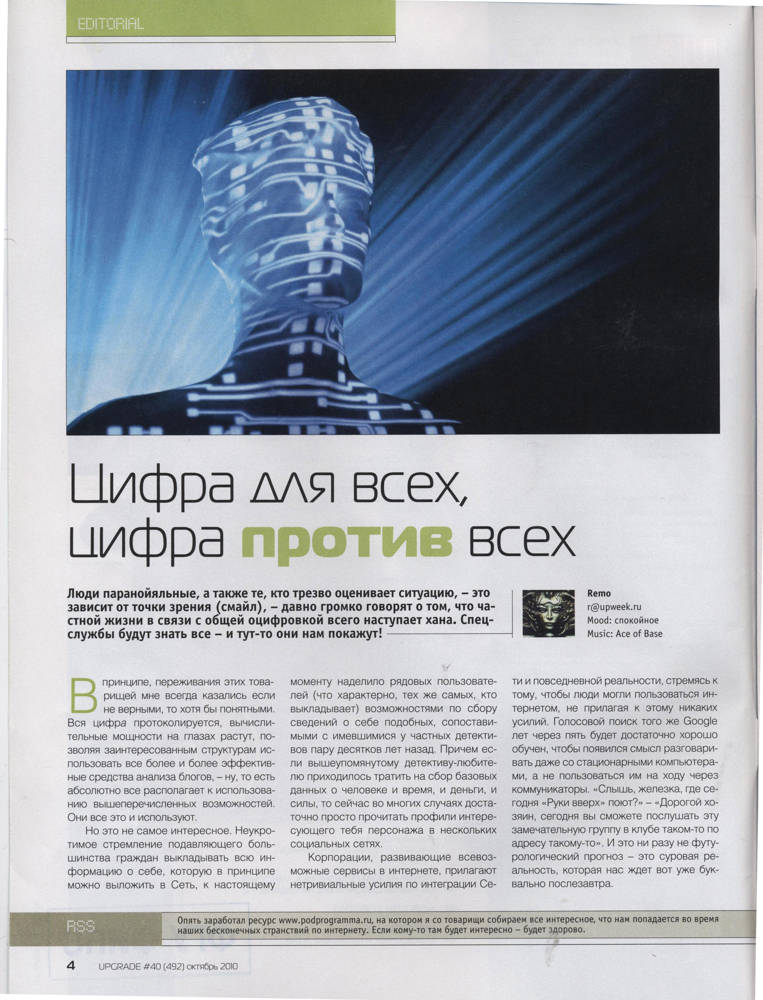
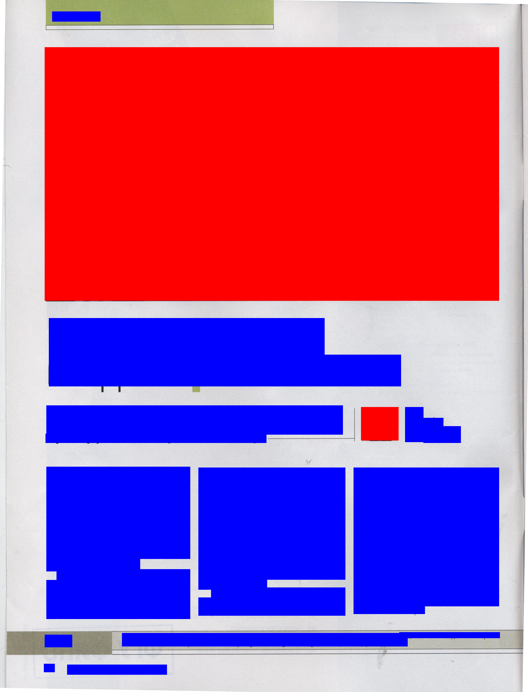
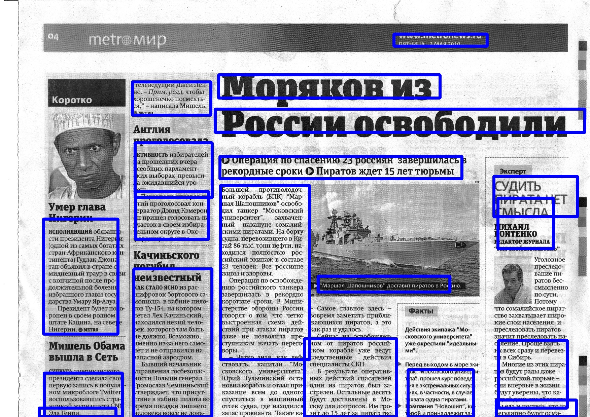
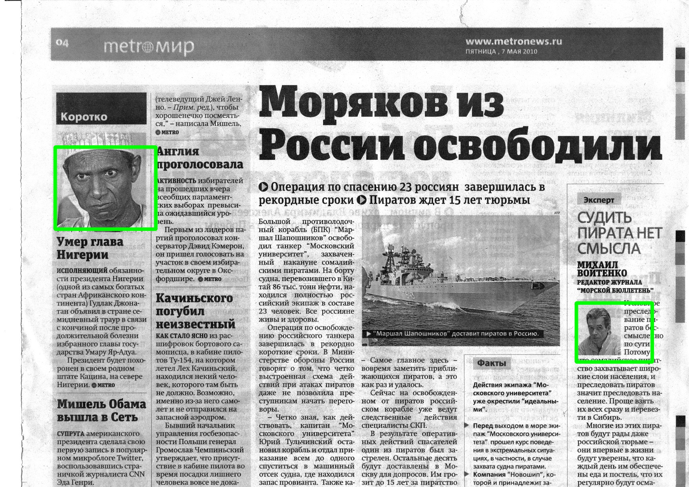
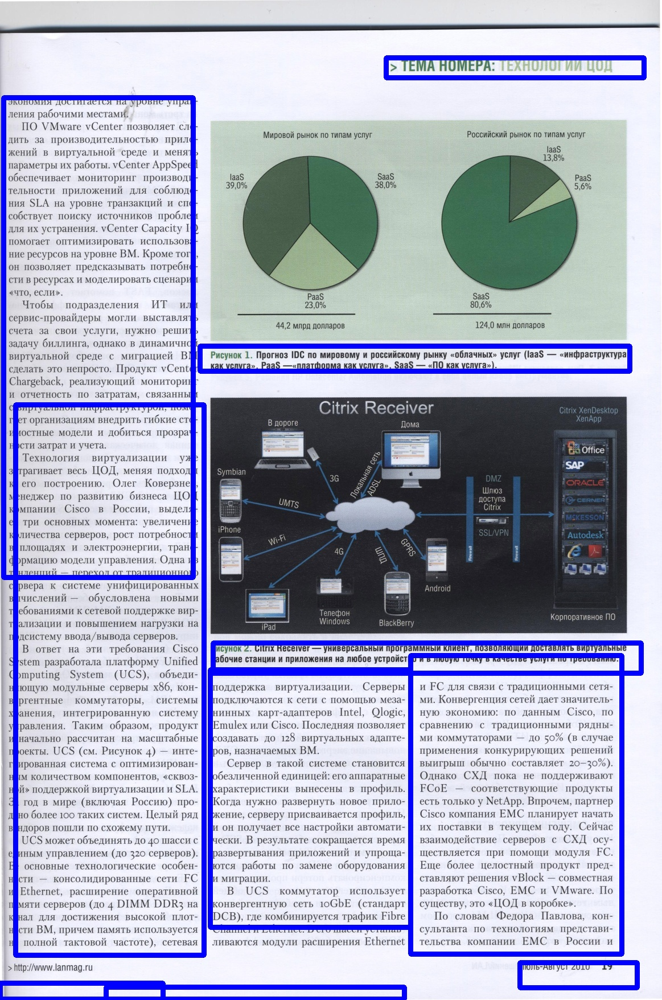
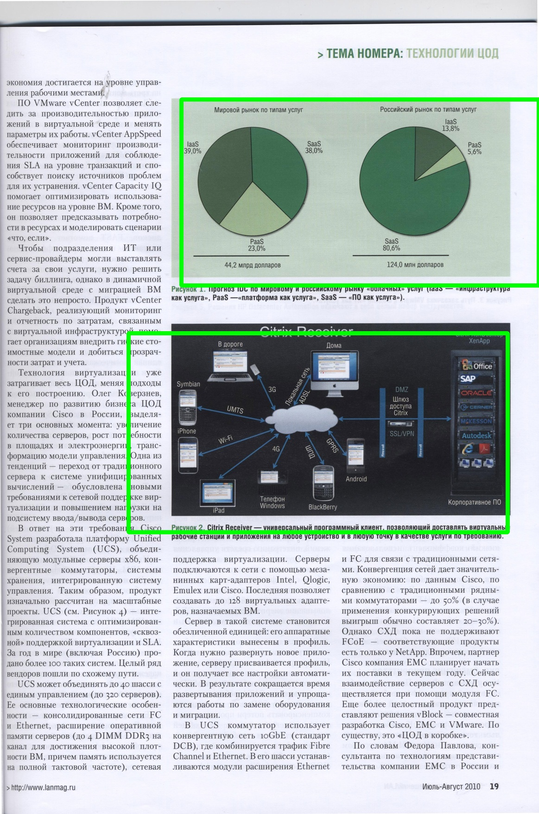
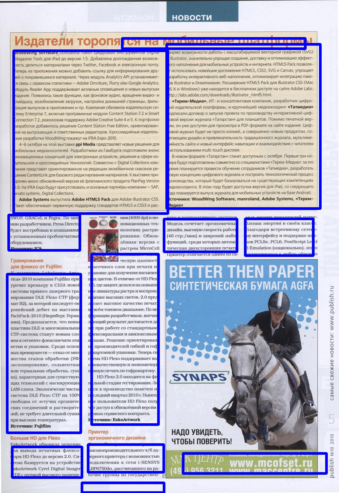
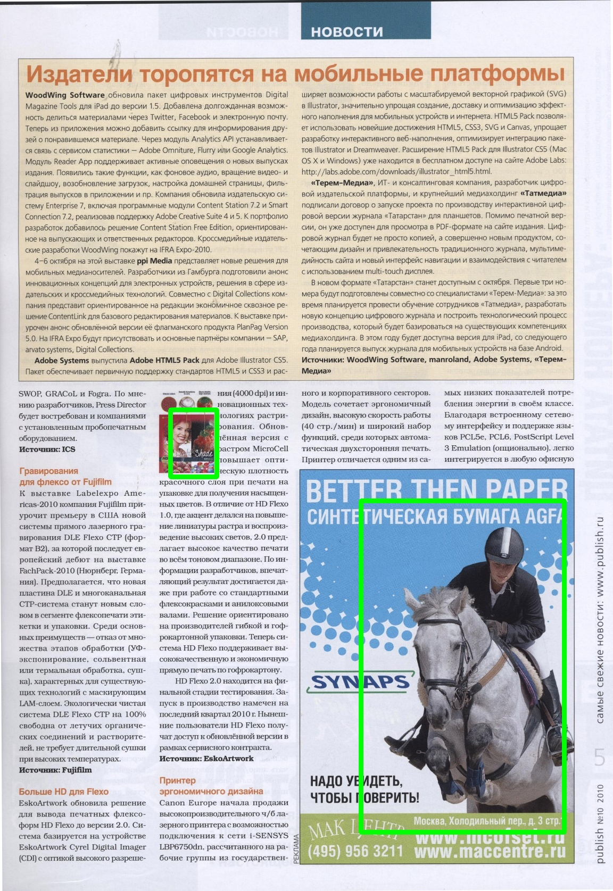

# Newspapers_clustering_using_py-faster-rcnn
In this repository we propose a Deep Learning approach for document clustering. This is an improvment of a [previous work](https://github.com/ykacer/Newspapers_clustering) that used traditional Machine Learning approach.

## Description
We use [py-faster-rcnn](https://github.com/rbgirshick/py-faster-rcnn) code from R.Ghirschik to learn text and image detection.

## Dataset

The used dataset is an ensemble of 102 Russian newpapers pages annotated and 
taken from [UCL Machine learning](https://archive.ics.uci.edu/ml/machine-learning-databases/00306/) site.
This is the dataset we use to tune faster-rcnn code (68 for training, 34 for testing)

We show below an example with ground truth:

#### page

  

#### ground truth

  

## formatting data 
To use faster-rcnn code, we need to reformate dataset  like Pascal-VOC challenge (comprising xml annotation files for bouding boxes).

But first of all, clone our fork of [py-faster-rcnn](https://github.com/ykacer/py-faster-rcnn) code into your home for example. This forl contains appropriate to deal with our newspapers dataset. 
Then open `import_data.py`, fill `main_path` variable with following path `yourhome/py-faster-rcnn/data/NewsPapers/UCL` and run it :

`python import_data.py`

It will create appropriate reformatting of our newspapers dataset into  `yourhome/py-faster-rcnn/data/NewsPapers/UCL`

## training/testing

Now go to `yourhome/py-faster-rcnn` and run the following command line

`./experiments/scripts/faster_rcnn_alt_opt.sh 0 VGG_CNN_M_1024 newspapers`

You will get test results into `yourhome/py-faster-rcnn/data/NewsPapers/UCL/results`, containing bounding boxes for text and for illustration, for each test image present into `yourhome/py-faster-rcnn/data/NewsPapers/UCL/ImageSets/Main/test.txt`

## Results

We present here after some testing results for text/illustration
### example
#### text

  

#### illustration

  

### example
#### text

  

#### illustration

  

### example
#### text

  

#### illustration

  

